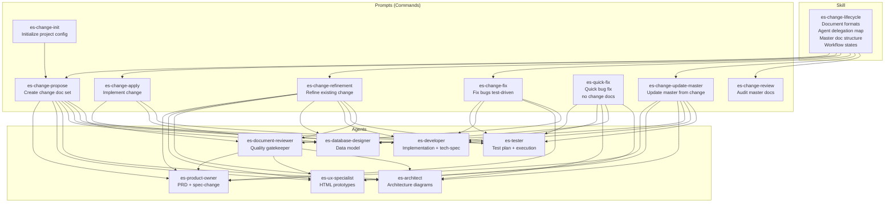

# easyspec

Spec-driven development kit for agentic coding tools — a shared set of prompts (commands), custom agent definitions, and skills that orchestrate a software engineering agent team through the full change lifecycle.

Supports **GitHub Copilot**, **OpenCode**, **Claude Code**, **Cursor**, **Windsurf**, and **Codex**.

## Architecture

```
┌──────────────────────────────────────────────────────────────────────┐
│                         easyspec Kit                                 │
│                                                                      │
│  templates/content/  ──  shared canonical source                    │
│                         (body files with frontmatter)                │
│                                                                      │
│  ┌─────────────────────┐    ┌────────────────────┐    ┌───────────┐ │
│  │      prompts/        │    │      agents/        │    │  skills/  │ │
│  │  (8 command bodies)  │────│  (7 specialist      │────│           │ │
│  │                      │    │   agent bodies)      │    │           │ │
│  └─────────────────────┘    └────────────────────┘    └───────────┘ │
│                                                                      │
│  templates/<tool>/  ──  generic templates per tool per entity type  │
│                         (one _template file per type, not per item)  │
│                                                                      │
│  CLI (easyspec init) ──  renders bodies through tool template       │
└──────────────────────────────────────────────────────────────────────┘
                                     │
          ┌──────────────────────────┼──────────────────────────┐
          ▼                          ▼                          ▼
     ┌──────────┐              ┌──────────┐              ┌──────────┐
     │ .copilot │              │.opencode │              │  .claude │
     │ prompts/ │              │ commands/│              │ prompts/ │
     │ agents/  │              │ agents/  │              │ agents/  │
     │ skills/  │              │ skills/  │              │ skills/  │
     └──────────┘              └──────────┘              └──────────┘
```

## Entity Relationship Diagram



**How it works:**

- **Prompts** are the conductors — each command orchestrates a workflow, delegates to agents, and manages state in `.change.yaml`.
- **Agents** are specialists — each owns specific document types and has strict DO/DON'T rules.
- **Skills** provide shared knowledge — document format conventions, master doc structure, and the agent delegation map.

### Prompt → Agent Delegation

| Prompt | Delegates To |
|--------|-------------|
| `es-change-init` | (standalone — scans project, generates config) |
| `es-change-propose` | product-owner, ux-specialist, architect, database-designer, developer, tester, document-reviewer |
| `es-change-apply` | developer, database-designer, tester |
| `es-change-refinement` | product-owner, ux-specialist, architect, database-designer, developer, tester, document-reviewer |
| `es-change-fix` | tester, developer, product-owner, document-reviewer |
| `es-quick-fix` | developer, tester, architect, database-designer, ux-specialist |
| `es-change-review` | (standalone — audits master docs) |
| `es-change-update-master` | product-owner, ux-specialist, architect, database-designer, developer, tester |

### Agent → Document Ownership

| Agent | Documents |
|-------|-----------|
| `es-product-owner` | `prd.md`, `spec-change.md` |
| `es-ux-specialist` | `prototype/index.html` |
| `es-architect` | `architecture.md` |
| `es-database-designer` | `data-model.md` |
| `es-developer` | `implementation-plan.md`, `tech-spec.md`, `deployment.md`, `operations.md` |
| `es-tester` | `test-plan.md`, `demo-cases.md` |
| `es-document-reviewer` | Reviews all agent outputs before workflow advances |

### Workflow

```
es-change-init    →  Initialize project config (docs/config.yaml)

es-change-propose →  Create full change documentation set
                     (PRD, architecture, data model, implementation plan, test plan)

es-change-apply   →  Implement change, run all test layers

es-change-update-master →  Merge change into master product docs

es-change-review  →  Audit master docs for quality and freshness

es-change-fix     →  Test-driven bug fixing with fix log

es-quick-fix      →  Quick bug fix (no change docs required)

es-change-refinement →  Incorporate adjustments into existing changes
```

## Install

**Recommended** — install globally for permanent use:

```bash
npm install -g @myaider/easyspec
```

**Try without installing** — run once via npx:

```bash
npx @myaider/easyspec init --scope project
```

## Real-world usage

easyspec was built to manage the development of [Parthenon](https://github.com/hurungang/parthenon) — an enterprise AI harness framework with 7+ microservices, 100+ documented features, and a complex architecture. The easyspec agent team manages everything from product specs to database migrations, keeping 100+ docs in sync across a multi-service codebase. If easyspec can tame Parthenon, it can handle your project.

## Usage

### Init — Install to a project or globally

```bash
easyspec init [options]
```

| Option | Values | Default | Description |
|--------|--------|---------|-------------|
| `--agent` | `copilot`, `opencode`, `cursor`, `windsurf`, `claude-code`, `claude`, `codex` | `copilot` | Target coding agent |
| `--scope` | `project`, `global` | `project` | Install scope |
| `--ide` | `auto`, `vscode`, `vscode-insiders`, `cursor`, `windsurf` | `auto` | IDE target for user-level sync |
| `--workspace` | `<path>` | cwd | Project folder for `--scope project` |
| `--force` | — | false | Overwrite existing files |
| `--dry-run` | — | false | Preview without writing |
| `--no-ide-user-sync` | — | false | Skip IDE user folder sync in global mode |
| `--tech-model` | `<name>` | — | Model for technical agents |
| `--non-tech-model` | `<name>` | — | Model for non-technical agents |
| `--model-preset` | `balanced`, `speed`, `quality` | — | Apply preset model pair |
| `--no-model-prompt` | — | false | Skip interactive model selection |

### Model Selection

During `init`, agents are classified as **technical** or **non-technical**:

| Classification | Agents |
|---------------|--------|
| Technical | `es-architect`, `es-database-designer`, `es-developer`, `es-tester` |
| Non-technical | `es-product-owner`, `es-document-reviewer`, `es-ux-specialist` |

Interactive prompts let you choose models per category, or use presets (`balanced`, `speed`, `quality`).

The CLI updates the `model:` field in each installed `*.agent.md` file.

### Destination Mapping

**Project scope** (`--scope project`):

| Agent | Prompt Destination | Agent Destination | Skill Destination |
|-------|-------------------|-------------------|-------------------|
| `copilot` | `<workspace>/.copilot/prompts/` | `<workspace>/.copilot/agents/` | `<workspace>/.github/skills/` |
| `opencode` | `<workspace>/.opencode/commands/` | `<workspace>/.opencode/agents/` | `<workspace>/.opencode/skills/` |
| `cursor` | `<workspace>/.cursor/prompts/` | `<workspace>/.cursor/agents/` | `<workspace>/.cursor/skills/` |
| `windsurf` | `<workspace>/.windsurf/prompts/` | `<workspace>/.windsurf/agents/` | `<workspace>/.windsurf/skills/` |
| `claude-code` / `claude` | `<workspace>/.claude/prompts/` | `<workspace>/.claude/agents/` | `<workspace>/.claude/skills/` |
| `codex` | `<workspace>/.codex/prompts/` | `<workspace>/.codex/agents/` | `<workspace>/.codex/skills/` |

**Global scope** (`--scope global`): same under `~/` instead of `<workspace>/`.

Global mode also syncs to detected IDE user folders for `copilot`, `cursor`, and `windsurf` (disable with `--no-ide-user-sync`).

## Examples

Install for Copilot in the current project:
```bash
easyspec init --scope project --agent copilot
```

Install for OpenCode globally:
```bash
easyspec init --scope global --agent opencode
```

Install for Claude Code with a specific model preset:
```bash
easyspec init --scope project --agent claude-code --model-preset balanced
```

Preview without writing:
```bash
easyspec init --scope project --agent opencode --dry-run
```

Non-interactive with explicit models:
```bash
easyspec init --scope project --agent copilot \
  --tech-model "GPT-5 (copilot)" \
  --non-tech-model "Claude Sonnet 4.5 (copilot)"
```

## Sync — Refresh templates from live source

For maintainers: refresh packaged templates from your current prompt and agent files.

```bash
easyspec sync --template-profile core
```

Options:
- `--source-prompts <path>` — Source prompt directory
- `--source-agents <path>` — Source agent directory
- `--include-agents <a,b,c>` — Explicit agent list
- `--force` — Overwrite existing files
- `--dry-run` — Preview without writing

## What is installed

### Prompts (Commands)

| File | Command |
|------|---------|
| `es-change-init.prompt.md` | `/es-change-init` |
| `es-change-propose.prompt.md` | `/es-change-propose` |
| `es-change-apply.prompt.md` | `/es-change-apply` |
| `es-change-refinement.prompt.md` | `/es-change-refinement` |
| `es-change-fix.prompt.md` | `/es-change-fix` |
| `es-change-review.prompt.md` | `/es-change-review` |
| `es-change-update-master.prompt.md` | `/es-change-update-master` |
| `es-quick-fix.prompt.md` | `/es-quick-fix` |

### Agents

| File | Agent Name |
|------|-----------|
| `es-architect.agent.md` | `es-architect` |
| `es-database-designer.agent.md` | `es-database-designer` |
| `es-developer.agent.md` | `es-developer` |
| `es-document-reviewer.agent.md` | `es-document-reviewer` |
| `es-product-owner.agent.md` | `es-product-owner` |
| `es-tester.agent.md` | `es-tester` |
| `es-ux-specialist.agent.md` | `es-ux-specialist` |

### Skills

| Directory | Skill Name |
|-----------|-----------|
| `es-change-lifecycle/SKILL.md` | `es-change-lifecycle` |

## Adding new prompts or agents

To add a new command or agent, only **one file** is needed — a content body file with frontmatter:

```
templates/content/prompts/<name>.body.md   (for commands)
templates/content/agents/<name>.body.md    (for agents)
```

Each body file carries its own frontmatter as the single source of truth:

```markdown
---
name: <entity-name>
description: <description>
model: <model>        (agents only)
tools: [<tool-list>]  (agents only)
---
<body content>
```

The generic templates in `templates/<tool>/<type>/_template.*` extract only the fields each tool needs. No per-entity template files are required.

### Adding a new tool

To add support for a new agentic coding tool:

1. Add an entry to `TOOL_PROFILES` in `src/cli.mjs`:
   ```js
   newtool: {
     configDir: ".newtool",
     agentExt: ".agent.md",
     promptExt: ".prompt.md",
     skillDir: ".newtool/skills",
   },
   ```
2. Add the tool name to the `SUPPORTED_AGENTS` array.
3. If the tool requires different file formats, add a transform function to `TOOL_PROFILES`.

## Release

Publishing is automated via the `Easyspec NPM Release` workflow. Just push a version tag:

1. Bump the `version` field in `package.json`.
2. Create and push a tag matching the new version (e.g., `git tag v0.1.0 && git push origin v0.1.0`).
3. GitHub Actions automatically tests and publishes to npm — no manual steps needed.

**Tag naming convention**:
- Stable releases: `v<semver>` (e.g., `v0.2.0`) — publishes to the `latest` dist-tag.
- Beta prereleases: `v<semver>-beta.<n>` (e.g., `v0.2.0-beta.1`) — publishes to the `beta` dist-tag.

Requires npm Trusted Publishing configured for this repo (no tokens needed).

Alternatively, run the workflow manually from the Actions tab and choose the desired `dist-tag` (`latest`, `beta`, or `alpha`).

## Notes

- All entity names use the `es-` prefix to avoid overriding user-defined agents, prompts, or skills.
- Content body files in `templates/content/` are the canonical source. Each carries its own frontmatter (`name`, `description`, `model`, `tools`) as the single source of truth.
- Generic templates in `templates/<tool>/<type>/_template.*` handle per-tool formatting — one template per tool per entity type, not per entity.
- Non-Copilot agents reuse the same Markdown payload; per-tool transformations happen at install time via generic templates and `TOOL_PROFILES`.
