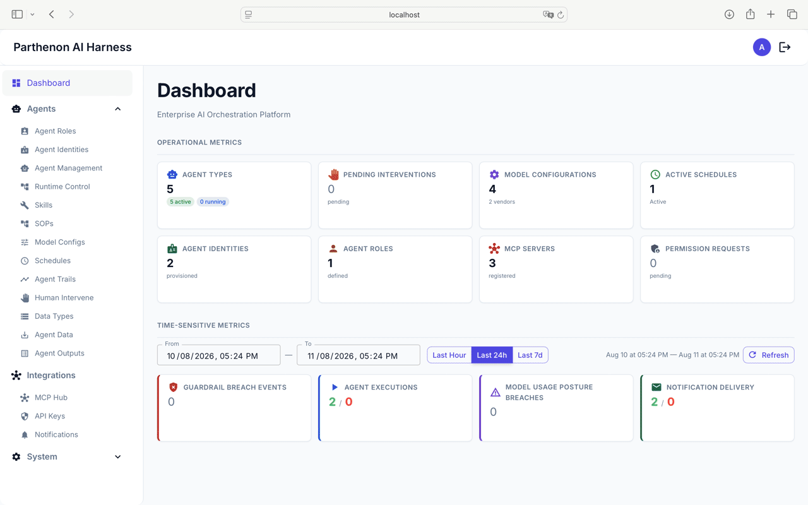
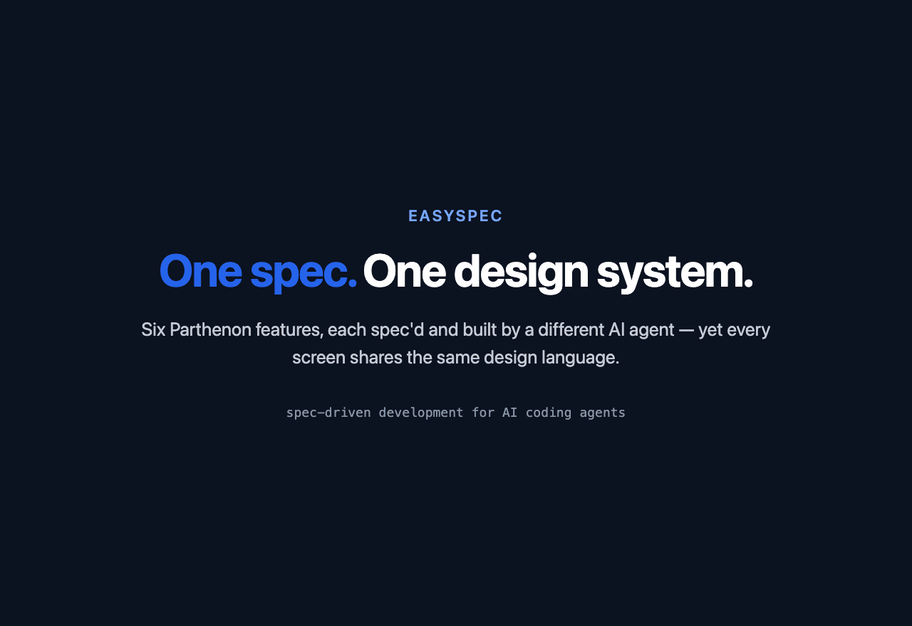

# easyspec — Spec-Driven Development Kit for AI Coding Agents

[](https://www.npmjs.com/package/@myaider/easyspec)
[](LICENSE)
[](https://nodejs.org/)
[](https://www.npmjs.com/package/@myaider/easyspec)

**One `init` command. A team of AI agents. Your entire software lifecycle — managed by specs, not chaos.**

Supports **GitHub Copilot**, **OpenCode**, and **Claude Code**.

> Built on the ideas of [OpenSpec](https://openspec.dev/) — the spec-driven development framework. Our spec format, agent delegation model, and change lifecycle are derived from OpenSpec's concepts. Thanks to the OpenSpec team.

## Showcase

**[Parthenon](https://github.com/hurungang/parthenon)** — a self-hosted enterprise AI harness — was built with easyspec, feature by feature, through the propose → apply → update-master pipeline.



The same spec-driven pipeline that keeps the code clean also keeps the UI consistent. Each screen below was prototyped by the UX agent for a *different* feature, yet every one shares the same design language:



## Install

**Recommended** — install globally:

```bash
npm install -g @myaider/easyspec
```

**Try without installing:**

```bash
npx @myaider/easyspec init
```

## Usage

### Init

```bash
easyspec init
```

Run interactively, the CLI asks two questions:

1. **Harness(es)** — which coding agent(s) to install for (multi-select: Copilot, OpenCode, Claude Code).
2. **Scope** — install into the current project, or globally into your user profile.

You can skip the prompts with flags:

| Option | Values | Default | Description |
|--------|--------|---------|-------------|
| `--agent` | `copilot`, `opencode`, `claude-code` (comma-separated for multiple) | interactive | Target coding agent(s) |
| `--scope` | `project`, `global` | interactive | Install scope |
| `--workspace` | `<path>` | cwd | Project folder for `--scope project` |
| `--force` | — | false | Overwrite existing files |
| `--dry-run` | — | false | Preview without writing |
| `--tech-model` | `<name>` | `auto` | Model for technical agents |
| `--non-tech-model` | `<name>` | `auto` | Model for non-technical agents |
| `--model-preset` | `balanced`, `speed`, `quality` | — | Apply a preset model pair |

Models default to **`auto`** — no need to pick one.

### Destination mapping

**Project scope** (`--scope project`):

| Agent | Commands | Agents | Skills |
|-------|----------|--------|--------|
| `copilot` | `<ws>/.github/prompts/` | `<ws>/.github/agents/` | `<ws>/.github/skills/` |
| `opencode` | `<ws>/.opencode/commands/` | `<ws>/.opencode/agents/` | `<ws>/.opencode/skills/` |
| `claude-code` | `<ws>/.claude/commands/` | `<ws>/.claude/agents/` | `<ws>/.claude/skills/` |

**Global scope** (`--scope global`): same paths under `~/` instead of `<ws>/`. Copilot global scope installs agents and skills only (GitHub Copilot has no user-level prompt files).

### Examples

```bash
# Interactive — multi-select harness(es) and scope
easyspec init

# Copilot in the current project
easyspec init --agent copilot --scope project

# Copilot and Claude Code in one run
easyspec init --agent copilot,claude-code --scope project

# OpenCode globally
easyspec init --agent opencode --scope global

# Claude Code with a model preset
easyspec init --agent claude-code --scope project --model-preset balanced

# Preview without writing
easyspec init --agent opencode --dry-run
```

### What is installed

**Commands:** `es-change-init`, `es-change-propose`, `es-change-apply`, `es-change-refinement`, `es-change-fix`, `es-master-review`, `es-change-update-master`, `es-quick-fix`

**Agents:** `es-product-owner`, `es-ux-specialist`, `es-architect`, `es-database-designer`, `es-developer`, `es-tester`, `es-document-reviewer`

**Skill:** `es-change-lifecycle`

## Acknowledgements

This project builds on [OpenSpec](https://openspec.dev/) — a spec-driven development framework. The spec format, agent delegation model, and change lifecycle are derived from OpenSpec's concepts. Thanks to the OpenSpec team for the foundational ideas.

## License

MIT
